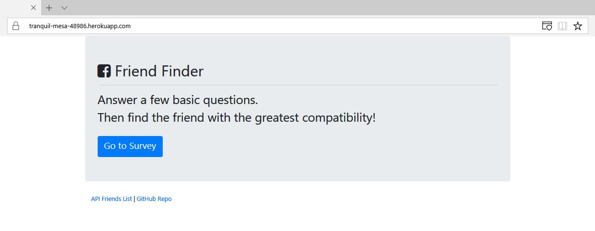
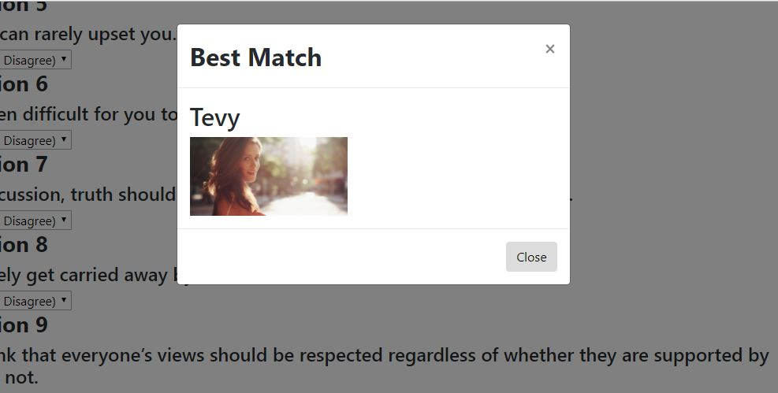

# FriendFinder

## Intro to the App
In this app, I have build a compatibility-based "FriendFinder" application -- basically a dating app. This full-stack site will take in results from the users' surveys, then compare their answers with those from other users. The app will then display the name and picture of the user with the best overall match.

## Requirements
* Express
* Path
* Body-parser
* Heroku

## Link to Heroku
[Link to Heroku!](https://tranquil-mesa-48986.herokuapp.com/)

## App Functionality
* You can access the survey from the homepage:

* The survey consists of 10 questions for the user, the final score from the user's input will determine the user's most compatible friend. 
   * Once your most compatible friend is found, a pop-up will appear with the name and picture of the closet match.

